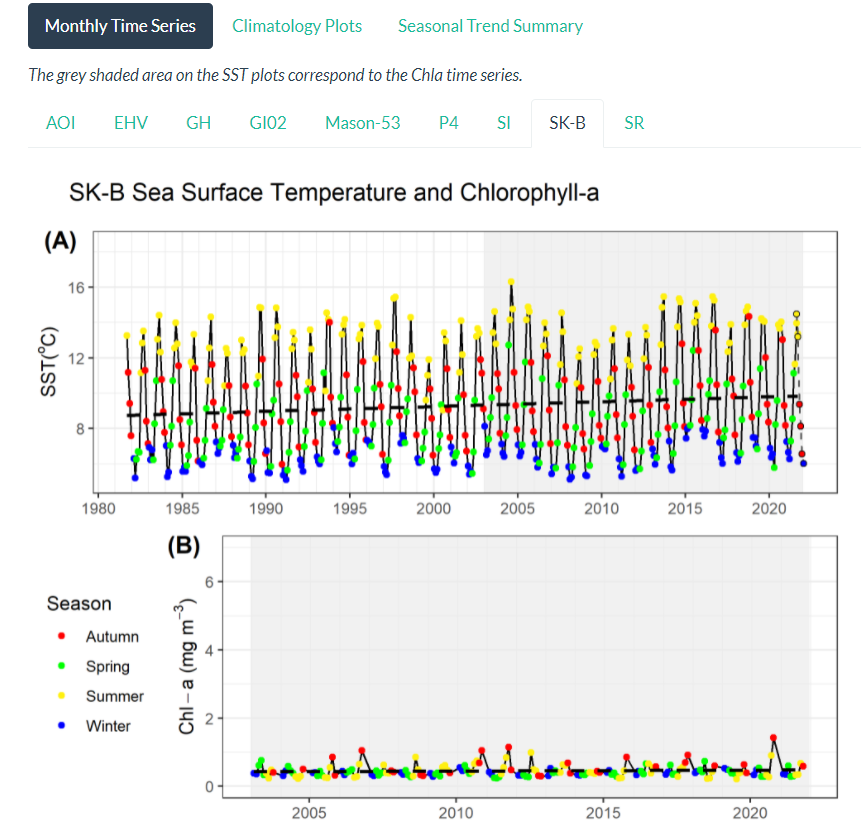
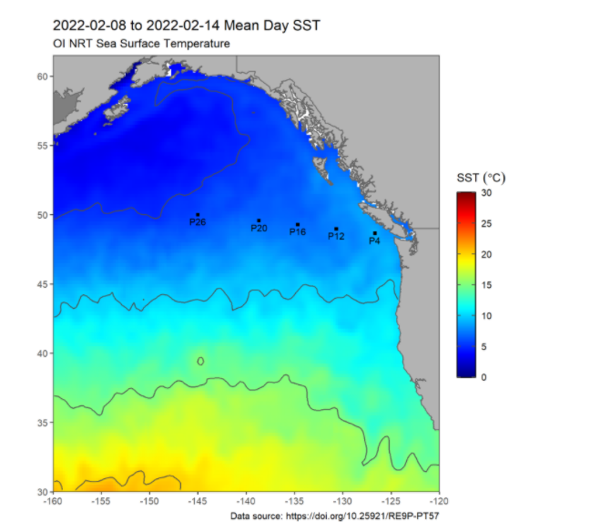

## Projects:

* [PhytoFit](https://github.com/BIO-RSG/PhytoFit): A Shiny app for viewing satellite chlorophyll-a and modelling phytoplankton blooms in Canadian waters

* [Canadian Pacific sea-surface temperature and chlorophyll-a from Marine Protected Areas and regions of interest](https://bio-rsg.github.io/SST_Chla_Report.html)

* [Recent maps and buoy data of Canadian Pacific sea-surface temperature tracking marine heatwaves](https://github.com/BIO-RSG/Pacific_SST_NRT_Monitoring)

## Datasets:

*

## Recent Publications and Reports:

* Galley, R., Devred, E., Hilborn, A, Michel, C. 2022. [Remotely-sensed sea-ice and chlorophyll a variability in the Beaufort Sea from 1998 to 2020.](https://waves-vagues.dfo-mpo.gc.ca/Library/41030035.pdf) Can. Tech. Rep. Hydrogr. Ocean Sci. 339: x + 90 p.
* Hardy, M., Devred, E., and Hannah, C. 2021. [Satellite observations of the Northeast Pacific Ocean.](https://waves-vagues.dfo-mpo.gc.ca/Library/4092855x.pdf) Can. Tech. Rep. Hydrogr. Ocean Sci. 335: vii + 46 p.
* * Wilson, K., Wong, M. and Devred, E. 2020. [Branching Algorithm to Identify Bottom Habitat in the Optically Complex Coastal Waters of Atlantic Canada Using Sentinel-2 Satellite Imagery.](https://www.frontiersin.org/articles/10.3389/fenvs.2020.579856/full) Front. Environ. Sci., 8. 10.3389/fenvs.2020.579856

## Other:

* [oceancolouR](https://github.com/BIO-RSG/oceancolouR): an (unofficial) R package with useful ocean colour processing functions
