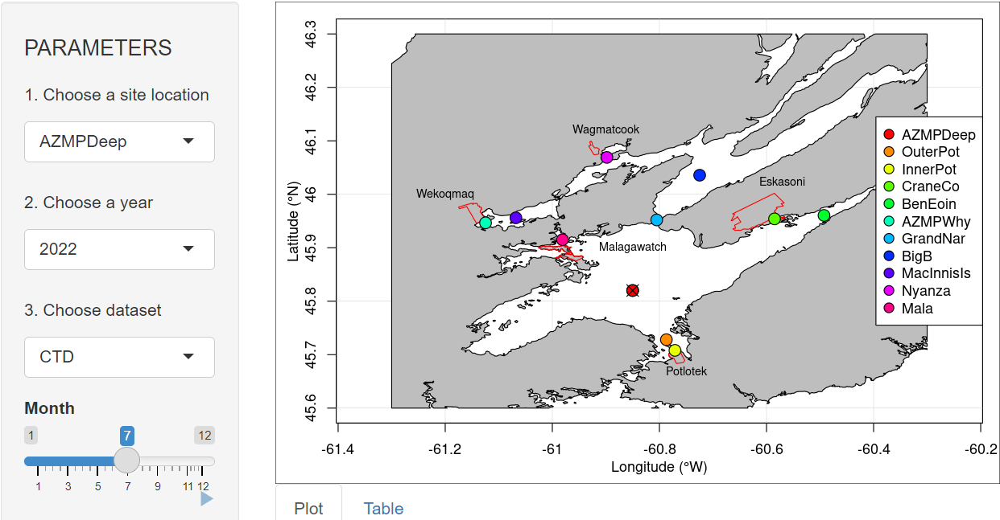

## Fieldwork and Outreach

* [Bras d'Or Lakes sampling and data visualization](https://mhardy.shinyapps.io/shinyBDL/): Monthly biogeochemical and physical data collected from stations in the Bras d'Or Lakes, Cape Breton, NS  

