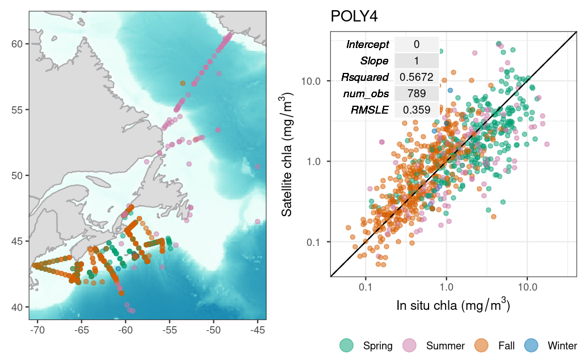
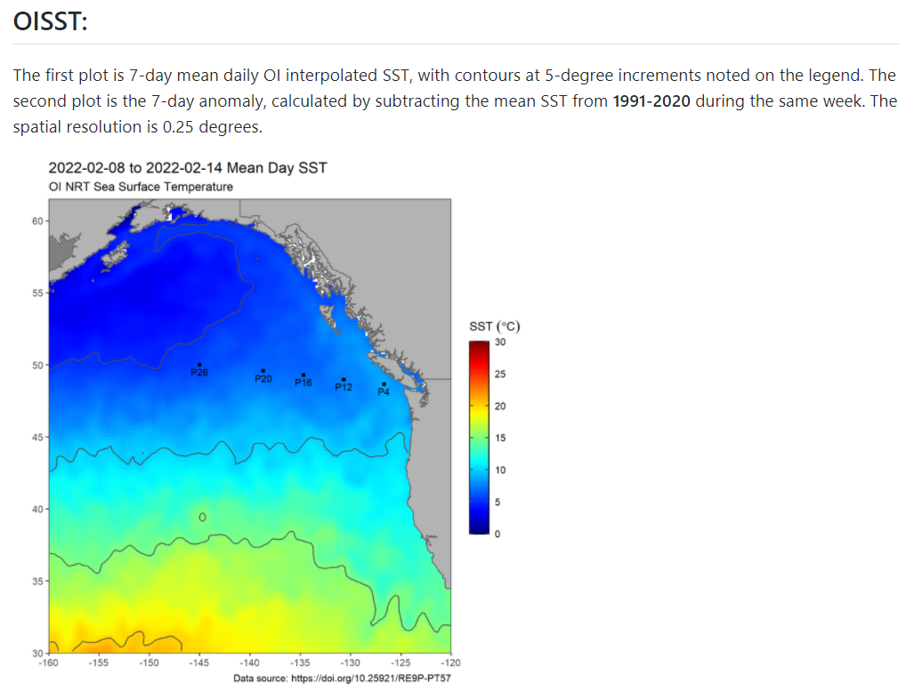

## Ongoing Projects

The list below makes up a few of our ongoing projects. 

* [PhytoFit](https://github.com/BIO-RSG/PhytoFit): A Shiny app for viewing and modelling phytoplankton blooms in Canadian waters

* [Validation of chlorophyll-a models](https://bio-rsg.github.io/chla_model_performance_summary.html)

* [Recent sea-surface temperature and anomaly maps and buoy time series](https://github.com/BIO-RSG/Pacific_SST_NRT_Monitoring) of the Northeast Pacific for tracking marine heatwaves

