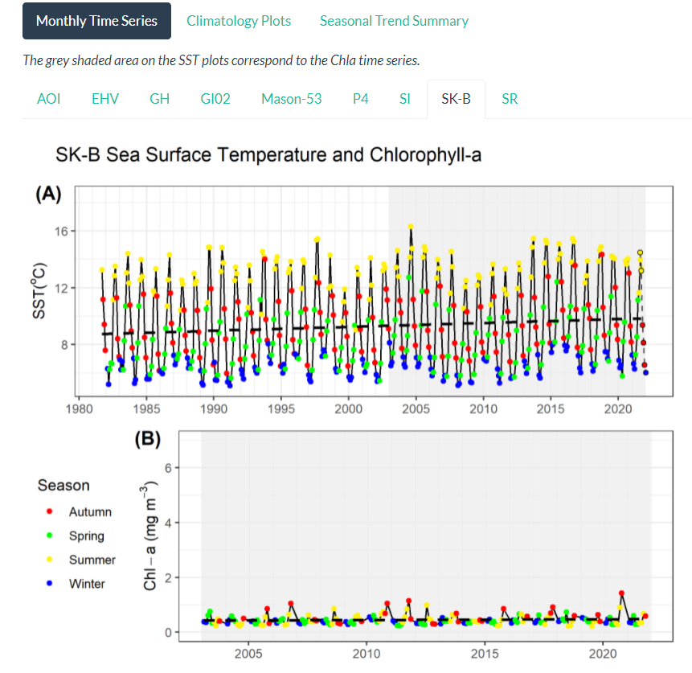

## Projects

* [PhytoFit](https://github.com/BIO-RSG/PhytoFit): A Shiny app for viewing and modelling phytoplankton blooms in Canadian waters

* [Validation of chlorophyll-a models](https://bio-rsg.github.io/chla_model_performance_summary.html) 

* [Recent sea-surface temperature and anomaly maps and buoy time series](https://github.com/BIO-RSG/Pacific_SST_NRT_Monitoring) of the Northeast Pacific for tracking marine heatwaves

* [Sea-surface temperature and chlorophyll-a concentration time series](https://bio-rsg.github.io/SST_Chla_Report.html) in Pacific Marine Protected Areas and regions of interest

## Recent Publications
* Clay, S. and Devred, E. **2023**. [SOPhyE Satellite Data Processing Technical Report Series: 1. Ocean Colour Satellite Intercalibration.](https://waves-vagues.dfo-mpo.gc.ca/library-bibliotheque/4119620x.pdf) Can. Tech. Rep. Fish. Aquat. Sci. 3560: vi + 42 p. 
* Devred, E., Perry, T., Massicotte, P. **2022**. [Seasonal and decadal variations in absorption properties of phytoplankton and non-algal particulate matter in three oceanic regimes of the Northwest Atlantic.](https://www.frontiersin.org/articles/10.3389/fmars.2022.932184/full) Front. Mar. Sci., 9. doi:10.3389/fmars.2022.932184
* Hilborn, A., Devred, E. **2022**. [Delineation of Eastern Beaufort Sea Sub-regions Using Self-Organizing Maps Applied to 17 Years of MODIS-Aqua Data.](https://www.frontiersin.org/articles/10.3389/fmars.2022.912865/full) Front. Mar. Sci., 9:912865. doi:10.3389/fmars.2022.912865
*  Wilson, K. L., Wong, M. C. and Devred, E. **2022.** [Comparing Sentinel-2 and WorldView-3 Imagery for Coastal Bottom Habitat Mapping in Atlantic Canada.](https://www.mdpi.com/2072-4292/14/5/1254/htm) Remote Sens., 14(5): 1254. doi:10.3390/rs14051254 
* Galley, R., Devred, E., Hilborn, A, Michel, C. **2022.** [Remotely-sensed sea-ice and chlorophyll a variability in the Beaufort Sea from 1998 to 2020.](https://waves-vagues.dfo-mpo.gc.ca/Library/41030035.pdf) Can. Tech. Rep. Hydrogr. Ocean Sci. 339: x + 90 p.
* Hardy, M., Devred, E., and Hannah, C. **2021.** [Satellite observations of the Northeast Pacific Ocean.](https://waves-vagues.dfo-mpo.gc.ca/Library/4092855x.pdf) Can. Tech. Rep. Hydrogr. Ocean Sci. 335: vii + 46 p.
* Devred, E., Hilborn, A., and den Heyer, C. E. **2021.** [Enhanced chlorophyll-a concentration in the wake of Sable Island, eastern Canada, revealed by two decades of satellite observations: a response to grey seal population dynamics?](https://bg.copernicus.org/articles/18/6115/2021/) Biogeosciences, 18, 6115–6132. doi:10.5194/bg-18-6115-2021
* Wilson, K. L., Wong, M. C. and Devred, E. **2020.** [Branching Algorithm to Identify Bottom Habitat in the Optically Complex Coastal Waters of Atlantic Canada Using Sentinel-2 Satellite Imagery.](https://www.frontiersin.org/articles/10.3389/fenvs.2020.579856/full) Front. Environ. Sci., 8: 579856. doi:10.3389/fenvs.2020.579856
* Clay, S., Peña, A., DeTracey, B., Devred, E. **2019.** [Evaluation of Satellite-Based Algorithms to Retrieve Chlorophyll-a Concentration in the Canadian Atlantic and Pacific Oceans.](https://www.mdpi.com/2072-4292/11/22/2609/htm) Remote Sens. 11, 2609. doi:10.3390/rs11222609

## Datasets

#### Arctic:

* [Chlorophyll-a concentration two-week composites](https://open.canada.ca/data/en/dataset/ee27e86f-7b18-4e3f-8444-0c5efb6110a4) of the Canadian Beaufort Sea, 1998-2020 (1 km spatial resolution, MODIS-Aqua)

#### Pacific: 
* [Chlorophyll-a concentration monthly climatology](https://open.canada.ca/data/en/dataset/5a7d1e1b-edeb-4a32-b17f-2ef053ca22d5) of the Pacific Exclusive Economic Zone, 2003-2020 (1 km and 4km spatial resolution, MODIS-Aqua)
* [Sea Surface Temperature monthly climatology](https://open.canada.ca/data/en/dataset/ecca47d7-835b-419f-91ae-ae4f601070a3) of the Pacific Exclusive Economic Zone, 2003-2020 (1 km, MODIS-Aqua)
* [Sea Surface Temperature monthly climatology](https://open.canada.ca/data/en/dataset/cec45ade-3647-4aec-84f1-8cb68dd305c2) of the Pacific Exclusive Economic Zone, 1981-2010 (4 km, AVHRR)
* [Sea Surface Temperature monthly climatology](https://open.canada.ca/data/en/dataset/a67df54b-286d-4eb6-9b38-474f1efe86db) of the Pacific Exclusive Economic Zone, 1990-2020 (4 km, AVHRR)

#### Atlantic:

* [Bottom Habitat Maps](https://github.com/BIO-RSG/Worldview3_Sentinel_Comparison_Project) of vegetated habitat it select regions of Nova Scotia, 2016-2020 (2 m and 10 m spatial resolution, Worldview-3 & Sentinel-2)
* Sea Surface Temperature seasonal and yearly climatologies of select regions in Nova Scotia, 2013-2020 (30 m  spatial resolution contact, Landsat-8; contact for dataset) 

## Other:

* [oceancolouR](https://github.com/BIO-RSG/oceancolouR): an (unofficial) R package with useful ocean colour processing functions 
