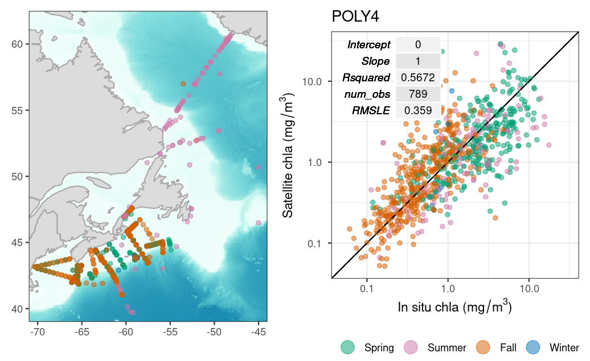
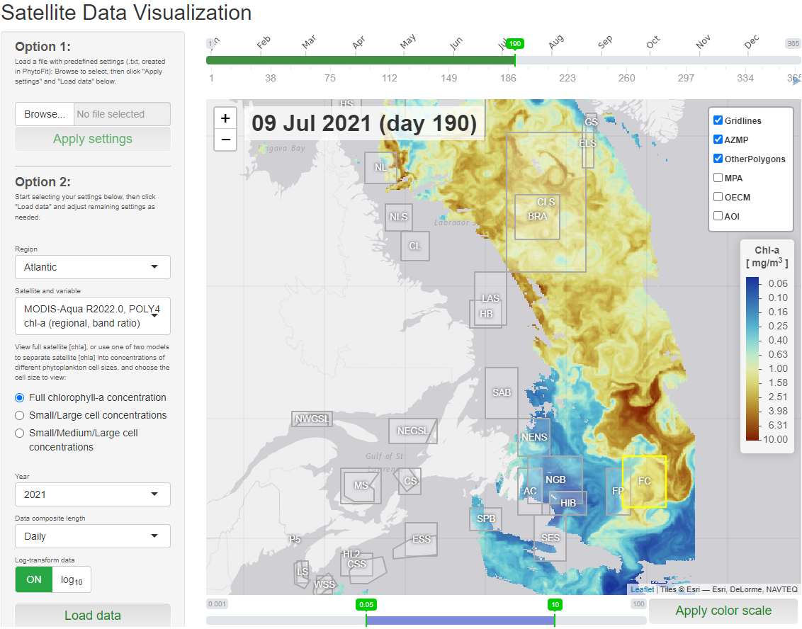
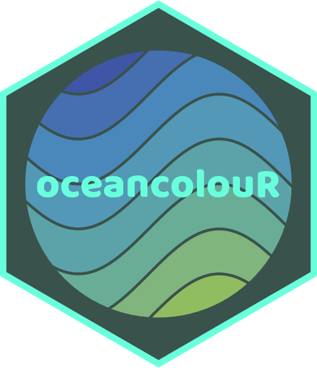

## Satellite Remote Sensing

* [Validation of chlorophyll-a models](https://bio-rsg.github.io/chla_model_performance_summary.html)

* <b>PhytoFit</b>: A Shiny app for viewing and modelling phytoplankton blooms in Canadian waters ([Github repo](https://github.com/BIO-RSG/PhytoFit)) ([Public host](https://cioosatlantic.ca/phytofit/))  

* [Recent sea-surface temperature and anomaly maps and buoy time series](https://github.com/BIO-RSG/Pacific_SST_NRT_Monitoring) of the Northeast Pacific for tracking marine heatwaves

* [oceancolouR](https://github.com/BIO-RSG/oceancolouR): an (unofficial) R package with useful ocean colour processing functions   

